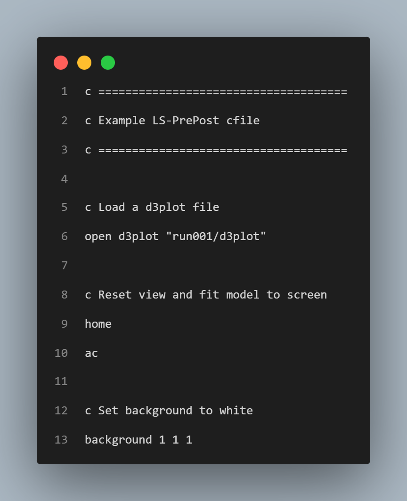
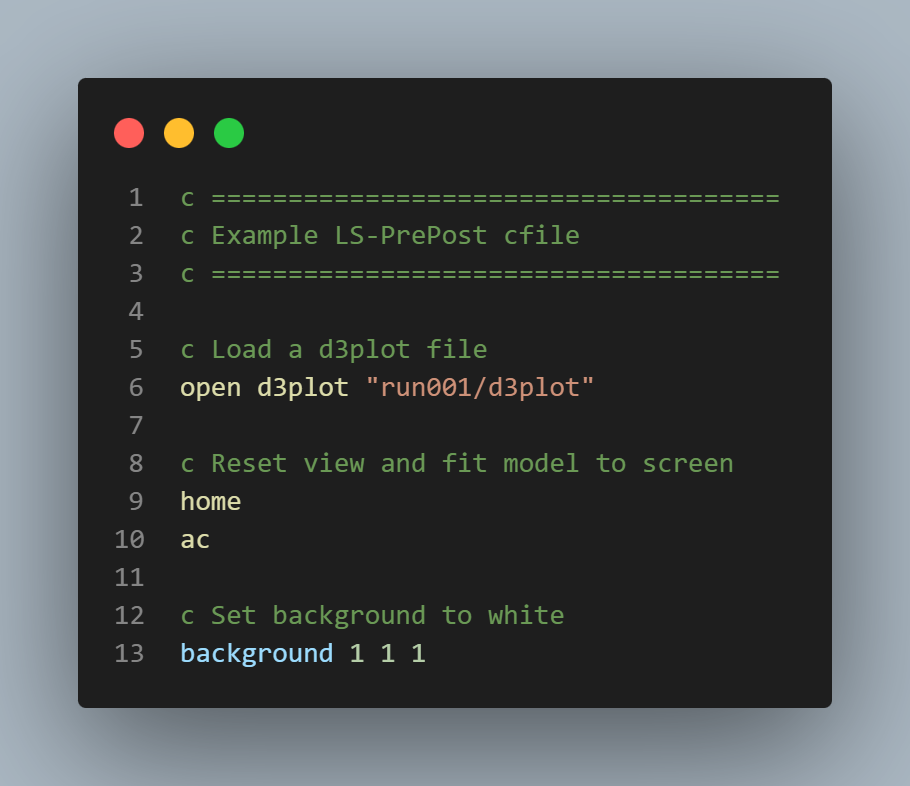

# LSDYNA LS-PrePost CFile Support

This extension provides language support for LS-DYNA LS-PrePost command files (`.cfile`) in Visual Studio Code.

It makes editing LS-PrePost command files easier and more readable by adding highlighting and command assistance.

## Features
* Adds a file icon for the `.cfile` extension for easy identification
* Syntax and semantic highlighting for LS-PrePost commands, arguments, strings, and comments
* Hover documentation for some commands
* Command snippets and autocomplete for [documented LS-PrePost commands](https://ansyshelp.ansys.com/public/account/secured?returnurl=/Views/Secured/corp/v251/en/lsdyna_prepost/lspp_ug_cmd_index_basic_cmd.html)

<table>
    <tr>
        <th>Before</th>
        <th>After</th>
    </tr>
    <tr>
        <td>
            
        </td>
        <td>
            
        </td>
  </tr>
</table>

## Install
Install from the [VS Code Marketplace](https://marketplace.visualstudio.com/items?itemName=DavidGable.lsdyna-ls-prepost-cfile-support)
or search for **LS-DYNA LS-PrePost CFile Support** in the Extensions view.

## Known Issues/Limitations
* This extension currently focuses on core LS-PrePost commands.
Not all commands or argument combinations may be supported yet.
* Hover documentation is a little broken
* No command validation

## Disclaimer
This extension is not affiliated with or endorsed by Ansys.
It is an unofficial project provided as-is.
